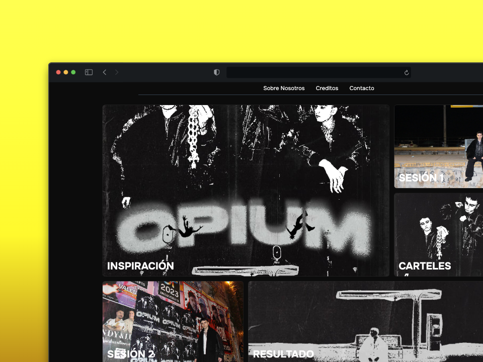

<h1 align="center">
   
  
   
  GALLERY SESSION
   
</h1>

<h4 align="center">Online Gallery about a photography session</h4>

  <a href="#about">About</a> •
  <a href="#tools">Tools</a> •
  <a href="#credits">Credits</a> •

## About
* This website is like a online magazine where you can see all the process about a photography session. On it we tell all the steps that we follow to finish the project
  
## Tools

- I developed this project to know about Astro. And I see that Astro is a very good tool for creating static websites like this.

## Credits

This software uses the following open source packages:

- [Astro](https://astro.build/)
- [Tailwind](https://tailwindcss.com/)

## Related

[https://opium-session.web.app/](https://opium-session.web.app/) - Website

---

> GitHub [@pabloconejos](https://github.com/pabloconejos) &nbsp;&middot;&nbsp;
> Twitter [@konezk_](https://twitter.com/konezk_)
> Instagram [@alivezk_](https://www.instagram.com/alivezk_/)
> Linkedin [Pablo Conejos](www.linkedin.com/in/pablo-conejos-chirivella-145024252)

